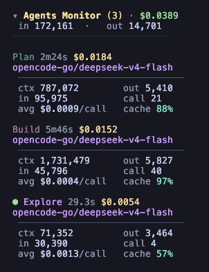

# @alvarovfon/opencode-agent-monitor

[](https://www.npmjs.com/package/@alvarovfon/opencode-agent-monitor)
[](LICENSE)
[](https://github.com/AlvaroVFon/opencode-agent-monitor/actions/workflows/ci.yml)

Real-time TUI monitor, JSONL tracing plugin, and CLI metrics tool for OpenCode. Track LLM calls, agent delegations, tool calls, and session events with live cost breakdowns per agent and model.

## Live TUI Monitor



Real-time sidebar panel that shows per-agent cost, context tokens, call stats, and errors — updated live as OpenCode runs.

## Installation

### Via OpenCode (recommended)

```bash
opencode plugin @alvarovfon/opencode-agent-monitor
```

This adds the server plugin to `~/.config/opencode/opencode.json` and the TUI plugin to `~/.config/opencode/tui.json`:

```json
{
  "$schema": "https://opencode.ai/config.json",
  "plugin": ["@alvarovfon/opencode-agent-monitor"]
}
```

```json
{
  "$schema": "https://opencode.ai/tui.json",
  "plugin": ["@alvarovfon/opencode-agent-monitor"]
}
```

### Features

- **Sidebar panel** — agents sorted by cost descending. Each row shows cost, per-model breakdown, context tokens (input/output), call count, cache hit rate, average cost per call, and error count. The currently active agent is marked with a dot.
- **Fullscreen dialog** — press `Ctrl+A` to toggle an expanded table with totals and per-model breakdown.
- **Persistent cursor** — the trace file cursor survives TUI restarts, so you never miss events between sessions.

The trace directory is read from the same `traceDir` option used in the server plugin config (default: `~/.config/opencode/.tracing`).

## Schema Evolution

Events written to `trace.jsonl` include a `schemaVersion` field.

- **Minor changes (Additive):** New fields can be added to existing events without bumping the major version.
- **Major changes (Breaking):** If fields are renamed or removed, the `schemaVersion` will be incremented.
- **Migration Policy:** The CLI and TUI are designed to handle multiple schema versions where feasible, but we recommend keeping the package updated to ensure full compatibility.

## CLI Usage

### Quick start (no install)

```bash
npx @alvarovfon/opencode-agent-monitor stats
npx @alvarovfon/opencode-agent-monitor stats --since 24h --top 5 --json
npx @alvarovfon/opencode-agent-monitor errors --since 7d --limit 10
npx @alvarovfon/opencode-agent-monitor export --since 30d --format markdown
```

### Global install

```bash
npm install -g @alvarovfon/opencode-agent-monitor
agent-monitor stats
```

Three subcommands (`stats`, `errors`, `export`). Full reference in [`src/cli/README.md`](src/cli/README.md).

## Components

The project ships three components that share the same `trace.jsonl` format:

- **Server plugin** — traces OpenCode events to JSONL. Configuration, event tables, and output format in [`src/server/README.md`](src/server/README.md).
- **TUI plugin** — live sidebar monitor with fullscreen dialog. Installation, keybindings, and architecture in [`src/tui/README.md`](src/tui/README.md).
- **CLI** — extract and analyze metrics from trace files. Subcommands, flags, and examples in [`src/cli/README.md`](src/cli/README.md).

## Local Development

```bash
git clone https://github.com/AlvaroVFon/opencode-agent-monitor.git
cd opencode-agent-monitor
pnpm install --ignore-scripts
pnpm build
```

Point your `~/.config/opencode/tui.json` to the local build:

```json
{
  "$schema": "https://opencode.ai/tui.json",
  "plugin": ["/path/to/opencode-agent-monitor/dist/tui.js"]
}
```

And your `~/.config/opencode/opencode.json` to the local server plugin:

```json
{
  "$schema": "https://opencode.ai/config.json",
  "plugin": ["/path/to/opencode-agent-monitor/dist/agent-monitor.js"]
}
```

## License

MIT
